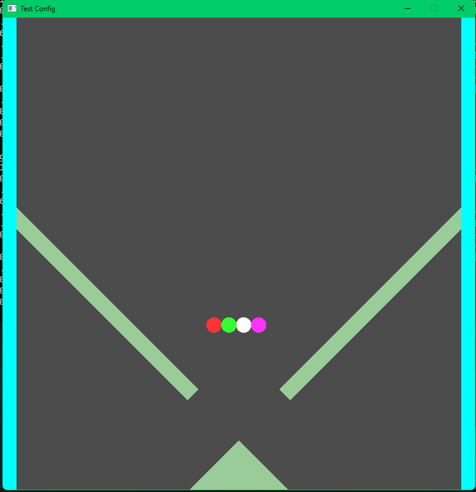
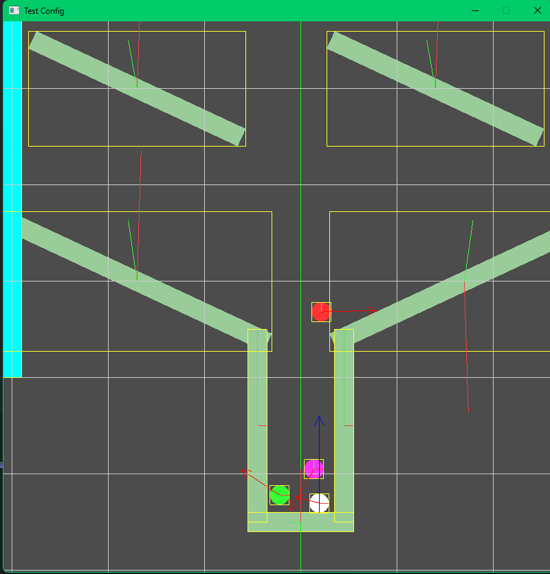
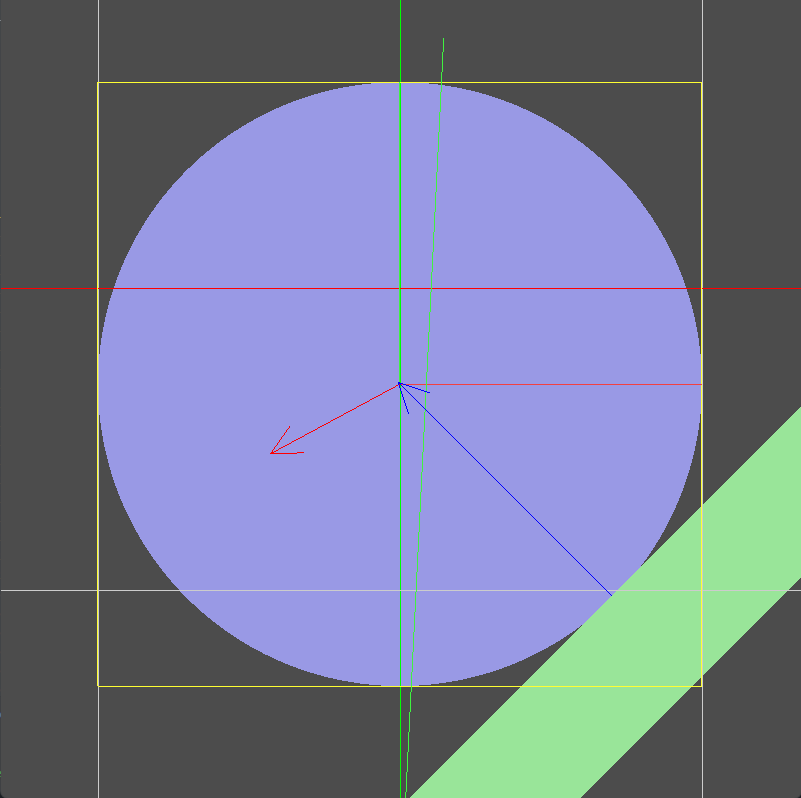

# SPEn

Spectre's Physics Engine

Simple 2D physics simulation.
Supports:

- Discrete time step based physics
- Collision Detection
- Impulse resolution

---

## Getting Started

### Prerequisites

- Go should be installed
- MinGW-w64 should be installed (Cgo is used for compiling c code. Can be insalled with MSYS2)

### Running steps

- Clone the repo
- $ cd spen
- $ go mod tidy
- $ go run main.go [Relative path to config file]
    - go run cmd\engine\main.go .\conf\marbleRace.json
    - Example configuration files are in conf directory

## Controls

| Key     | Action                           |
| ------- | -------------------------------- |
| P       | Pause                            |
| I       | Debug                            |
| L       | Step simulation 1 frame in pause |
| W,A,S,D | Control camers                   |
| < , >   | Zoom in and out                  |
| R       | reset camera to origin           |
| Esc     | Exit                             |

## Screenshots

